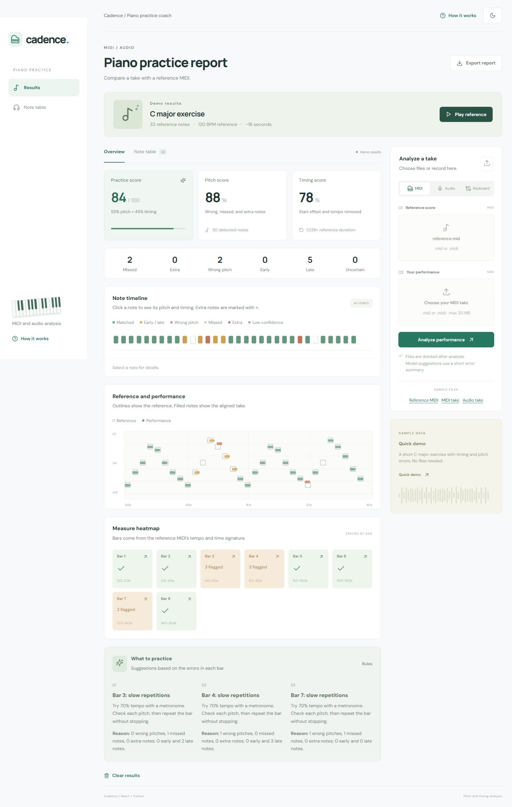

# Cadence

I built Cadence to compare a piano take with a MIDI reference and find the bars I should practice again. I use React for the report, FastAPI for uploads, pretty_midi for MIDI, and librosa for audio. The app checks pitch and timing. It does not grade musical expression.



## Quick demo, without installs

The repo includes a built demo in `demo/`. I keep it in the repo so the demo does not depend on downloading packages. From the project folder, run:

```sh
python demo_server.py
```

Open **http://127.0.0.1:5173**. Python 3 is the only requirement for this preview. Click **Quick demo**, **Play reference**, a note in the timeline, or a bar in the heatmap. **Export report** opens JSON I can download or copy. **Clear results** shows the empty state. The moon/sun button changes the theme.

The demo report is saved output from `backend/analysis.py`, with rule suggestions from `backend/recommendations.py`. The frontend does not make up scores. A test compares the saved JSON with a fresh Python result. The demo server serves that saved report; it does not analyze uploads. Stop it with Ctrl+C before starting the development frontend on the same port.

## Run real analysis

I tested the app on Windows with Node 24, Python 3.12, and a fresh Python 3.14 virtual environment. Use Node 20.19+ or 22.12+. Python 3.12 and 3.14 both passed my tests with the current dependencies.

From the project folder:

```sh
python -m venv .venv
```

Activate it on Windows PowerShell:

```powershell
.venv\Scripts\Activate.ps1
```

Then install and start the backend:

```sh
python -m pip install -r backend/requirements.txt
python -m uvicorn main:app --app-dir backend --host 127.0.0.1 --port 8000
```

In a second terminal:

```sh
cd frontend
npm ci
npm run dev
```

Open **http://127.0.0.1:5173**. The frontend forwards `/api` requests to Python on port 8000. API docs are at **http://127.0.0.1:8000/docs**. The first audio analysis can take longer because numerical functions compile. The saved demo starts quickly even without those packages.

## Input modes

**MIDI files:** choose `samples/reference.mid` and `samples/performance.mid`, then click Analyze performance. For my own music, I use two files covering the same passage. MIDI gives exact recorded pitch and note-on times. Chords are supported, but dense simultaneous notes can still make alignment ambiguous.

**Audio files:** choose the reference MIDI and `samples/performance.wav`. WAV, FLAC, and OGG are accepted. Audio results are estimates and work best on single-note passages in a quiet room. The tracker returns one pitch per attack. Chords, reverb, and pedal can confuse it. If the spectral check suggests overlapping sounds, the app warns me and hides the scores. `samples/chords.wav` is a short test of that warning.

**Microphone:** select Audio and click Record microphone. Allow the browser permission, play the passage, then stop. The browser saves mono PCM WAV before uploading it. Recording stops after 119 seconds. A pending permission request times out with a message. I tested the recording code with a generated audio stream, not a physical piano recording.

**Keyboard:** connect a USB MIDI keyboard and choose Keyboard. Use the optional reference MIDI field for another piece; leave it empty for the C major demo. Click Connect MIDI keyboard, record, then Stop & analyze. Note-off messages close each note. Still-held notes close when I stop. Chrome or Edge on localhost/HTTPS is needed. I tested synthetic MIDI messages; physical USB input and browser permission still need a manual check.

I limit each file to 20 MB, the whole request to 22 MB, each sequence to 600 notes, and passages to two minutes. MP3, WebM uploads, and sheet-music OCR are outside this version.

## How I score a take

I align note sequences with a dynamic program related to DTW. A step can match two notes, skip a missed reference note, or mark an extra played note. I use one-to-one matches so a missed note cannot be hidden by mapping several events to the same note.

Before scoring, I remove the recording's constant start delay and fit its overall tempo from matched notes. With enough matches, I also fit gradual acceleration when a smooth curve explains the drift better. A consistently slower take can score 100. An isolated late entrance still counts as a timing error. This fit is a heuristic; repeated passages and very uneven tempo can confuse it.

The report counts **wrong pitches**, **missed notes**, and **extra notes** separately. It also counts early and late matches. A wrong pitch can also have a timing error.

- For MIDI, every note has weight 1. For audio, a matched or extra note's weight is the tracker's median voiced probability near its onset, between 0 and 1. This is an uncertainty estimate, not a proven probability that its pitch is right. Missed reference notes have weight 1 because there is no detected note to measure.
- **Pitch score:** 100 times the weight of correct-pitch matches, divided by matched weight plus missed-note count plus extra-note weight. Wrong pitches add to the denominator but not the numerator.
- **Timing score:** each matched note gets `exp(-abs(offset_ms) / 150)`, weighted by confidence. I divide the sum by matched weight plus missed-note count, then multiply by 100. Missing notes contribute zero. Extra notes affect pitch score, not timing score.
- **Overall score:** 55% pitch score and 45% timing score. These weights are choices I made for practice feedback, not a validated proficiency scale.

Offsets beyond 80 ms are labeled early or late. Audio notes below 50% confidence are labeled uncertain and have less influence. Suspected polyphonic audio gets no numeric score. Counts still appear as estimates so I can inspect the detected events.

Bar boundaries come from the reference MIDI's tempo map and time signature. If the file omits a time signature, I assume 4/4 and show a warning. A pickup may be numbered differently from the printed score.

## Switch the recommender

Copy the example settings:

```powershell
Copy-Item .env.example .env
```

The backend loads `.env` when it starts. Restart it after changing the file.

```dotenv
RECOMMENDER=rules
```

**rules** is the default. It uses no model, network, or key. I get 3 to 5 suggestions tied to bar numbers, with reasons based on the measured errors. Each bar starts with its most common error type. Ties favor wrong pitches, then missed notes, timing, and extra attacks. Bars with the same problem get different drills. The whole app works in this mode.

```dotenv
RECOMMENDER=ollama
OLLAMA_URL=http://127.0.0.1:11434
OLLAMA_MODEL=llama3.2:3b
```

**ollama** uses an already-running local Ollama server and an installed model. There is no key. If it is unavailable, times out, or returns invalid JSON, the report says what happened and uses rules. I verified the stopped-server fallback and tested valid response handling with a mock. Actual local model generation remains a manual check.

```dotenv
RECOMMENDER=api
OPENAI_API_KEY=your-key
OPENAI_MODEL=gpt-4o-mini
API_REQUESTS_PER_MINUTE=5
MAX_REQUEST_MB=22
```

**api** calls a hosted model only if a key is set. It may cost money. A per-IP limit allows five hosted requests per minute by default; further reports use rules. A missing key, timeout, provider error, or invalid response also falls back to rules. I tested response validation and failure cases without making a paid call.

Both model modes receive only scores, error counts, and summaries for up to eight bars. They do not receive audio, filenames, or full note lists. I validate the JSON shape, string lengths, number of suggestions, and bar references before showing it. Keys stay on the backend. Never put a key in a `VITE_` variable.

## Tests and build

From the project folder, with the virtual environment active:

```sh
python -m pytest backend -q
python backend/generate_samples.py
```

From `frontend/`:

```sh
npm test
npm run build
npm run preview
```

For the browser capture check, use the development frontend and open **http://127.0.0.1:5173/tests/capture.html**. Click Run capture checks. It records generated sound through the real AudioWorklet, decodes the resulting WAV, and runs synthetic MIDI input through the same capture function used by the app. It does not request a microphone or ship in the production build.

To rebuild the saved demo after editing the frontend or analysis:

```sh
python backend/generate_samples.py
cd frontend
npm run build
cd ..
python tools/update_demo.py
```

## Files

- `backend/analysis.py`: MIDI/audio extraction, timing fit, sequence alignment, scores, and bars.
- `backend/recommendations.py`: rules, Ollama, hosted API, validation, and API rate limiting.
- `backend/main.py`: upload and capture routes, request-size limit, temporary-file cleanup.
- `frontend/src/main.jsx`: file selection, recording controls, playback, and theme.
- `frontend/src/Results.jsx`: scores, timeline, overlay, measure heatmap, table, and suggestions.
- `frontend/src/capture.js`: microphone WAV capture and MIDI event handling.
- `samples/`: original MIDI and synthesized audio.
- `demo/`: built frontend and saved Python report for the quick demo.
- [Architecture](docs/architecture.md) and [review notes](docs/review.md): design choices, checks, and remaining limits.

## Limits and next ideas

I do not score pedal, dynamics, articulation, fingering, or expression. The audio polyphony check can miss chords or flag a noisy single-note recording. Pitch confidence is also imperfect. The current audio samples are synthesized, so they do not establish accuracy on real pianos.

I do not save uploads or session history. Files are deleted after analysis. Export a report if I want to keep it. The per-IP limiter lives in one Python process and uses the socket IP; it is not a shared limiter for several workers. Behind a proxy, users may share that address.

For public hosting I would add authentication, an analysis queue, shared rate limits, and proxy limits. If frontend and backend are hosted separately, `VITE_API_URL` chooses the public API URL and `FRONTEND_ORIGINS` lists allowed frontend origins. I have not tested a public deployment.

Next I want to test real piano recordings with labeled note errors, align chords as groups, handle pickups better, and compare tempo fitting with chroma DTW. I would add progress history only after checking the analysis against real playing.

I used the [pretty_midi docs](https://craffel.github.io/pretty-midi/), [librosa pYIN docs](https://librosa.org/doc/0.11.0/generated/librosa.pyin.html), [Ollama API docs](https://docs.ollama.com/api/generate), and [OpenAI JSON output docs](https://developers.openai.com/api/docs/guides/structured-outputs). Code and original samples use the MIT license.
